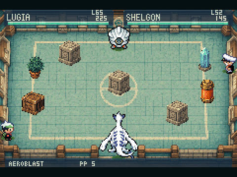

# Emerald Arena

Pokémon Emerald with real time battles. Inside the original GBA game.

[**Download Emerald Arena**](https://github.com/GBurgardt/pokemon-emerald-arena/releases/download/v0.10.1/Emerald-Arena-0.10.1.zip) · [Installation guide](PLAY.md)

[**Follow development on Twitter / X**](https://x.com/germanburgardt) for new previews, progress and updates.

[**Join the Discord**](https://discord.gg/GBVjbNhEdb) to chat, share ideas and report bugs. English and Spanish welcome.

## Watch gameplay

[New battles · 47 seconds with sound](media/emerald-arena-150.mp4) · [Full gameplay · 2:26 with sound](https://github.com/GBurgardt/pokemon-emerald-arena/raw/refs/heads/main/media/emerald-arena-full-gameplay.mp4)

[Playing on an AYN Thor · 16 seconds](https://github.com/GBurgardt/pokemon-emerald-arena/raw/refs/heads/main/media/emerald-arena-ayn-thor.mp4)

New in 0.10.1: 50 more animated Pokémon, Rollout, Reflect and Light Screen.
150 Pokémon, with larger Lugia, Ho-Oh and Salamence and better ground alignment.
[Watch the new gameplay](media/emerald-arena-150.mp4).

Dig, Fly, Teleport, Seismic Toss, Double Team and elemental terrain are still included. [Watch the four new moves · 46 seconds](media/emerald-arena-four-moves.mp4).
Seismic Toss was contributed by [Didier Lopes](https://github.com/DidierRLopes) in [PR #1](https://github.com/GBurgardt/pokemon-emerald-arena/pull/1).
[Changes](RELEASE.md) · [Recording details](media/README.md).

## Start playing

You need your own unmodified **Pokémon Emerald (USA/Europe)** ROM and a GBA emulator.

1. **Extract the ZIP.** Open `Prepare-Emerald-Arena.html` on your computer.
2. **Choose your Emerald ROM.** Wait for preparation, then click **Download game**.
3. **Open the finished game in your emulator.** Start or continue your adventure normally.

For a quick try on a fresh save, press **SELECT** on **NEW GAME** to skip the intro and start with Charizard and five teammates; press **L + R together** in the field to fight.

[Setup, keyboard controls and help](PLAY.md) · [1-minute setup video](https://github.com/GBurgardt/pokemon-emerald-arena/releases/download/v0.3.3/emerald-arena-walkthrough.mp4)

## What's included

- Move, aim and dodge in real time battles.
- Break rocks and other objects with your attacks.
- Catch wild Pokémon and keep them in your team or PC.
- Keep your team's HP, PP, experience and saves.

Supported wild and single trainer battles use the arena automatically. Double, link and unsupported battles stay classic.
[Supported Pokémon, moves and limits](PLAY.md#current-scope).

## Controls

Direction buttons to move. **A** to attack. **B + a direction** to dodge. **START** to pick a move.
Hold **L + R** to aim a Poké Ball; release to throw, **B** to cancel.
[All controls](PLAY.md#controls).

## Source

Built on [pret/pokeemerald](https://github.com/pret/pokeemerald).
The download is a patch and installer, not a ROM.

[Build](BUILD.md) · [How it works](HOW-IT-WORKS.md) · [Release notes](RELEASE.md) · [Credits](CREDITS.md) · [Report a problem](https://github.com/GBurgardt/pokemon-emerald-arena/issues/new?template=bug_report.yml)

New project code is [MIT](LICENSE). Independent, unofficial project.
